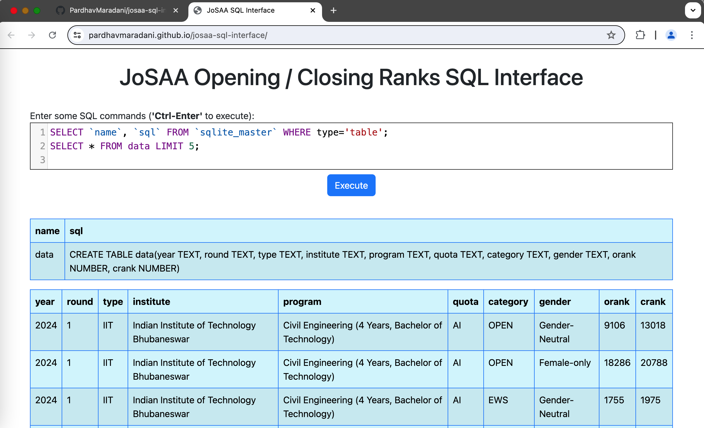
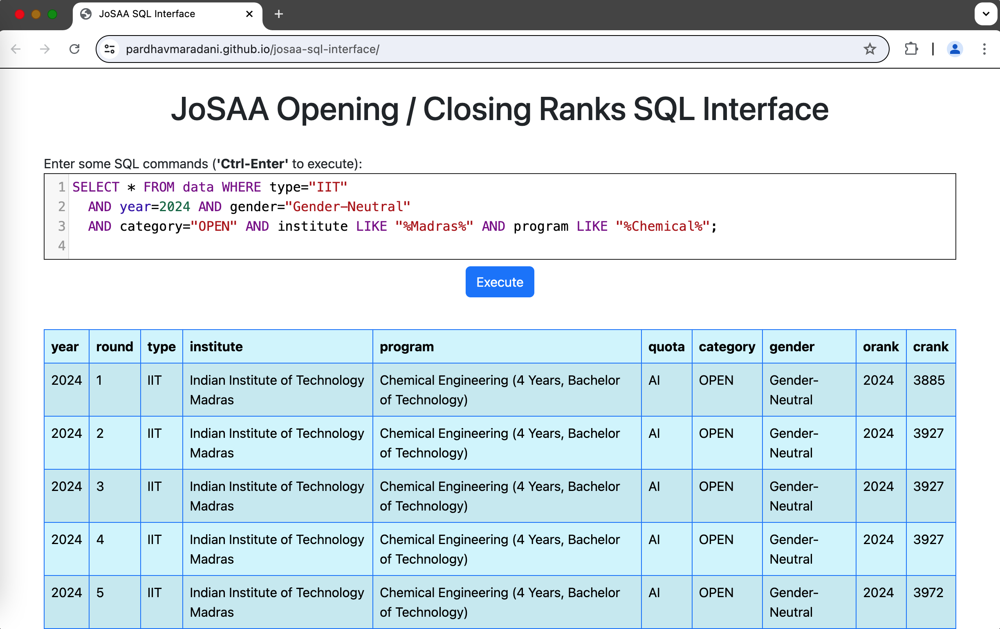

# JoSAA SQL Interface

This is a browser based **SQL Interface** for JoSAA Opening and Closing Rank [data](https://josaa.nic.in/or-cr/), which allows you to explore and analyze using **SQL** queries.

## Analyze

- Click [here](https://pardhavmaradani.github.io/josaa-sql-interface/) to analyze this data in your browser
  - The Anaysis URL is https://pardhavmaradani.github.io/josaa-sql-interface/
  - > Note that for the very first time, it could take a few seconds / minutes to download the database and set it up depending on your internet speed (The database file is ~19MB)
  - All queries work locally in your browser after that
- The web interface should look something like this:



- Enter your **SQL** commands in the textarea and click on the `Execute` button or `Ctrl-Enter` to see the results.



- The `db/josaa-2016-2024-all.db` file can be downloaded and analyzed locally using `sqlite` as well
- All the CSV's of the data are available separately in the `csv` folder and can be analyzed in any spreadsheet tool

## About the data

- The database consists of Opening and Closing rank details of all institutes (IITs, NITs, IIITs and GFTIs) that take part in JoSAA for all academic programs and all categories for the years shown below:

  - 2024 - rounds 1 through 5 (final)
  - 2023 - final round 6
  - 2022 - final round 6
  - 2021 - final round 6
  - 2020 - final round 6
  - 2019 - final round 7
  - 2018 - final round 7
  - 2017 - final round 7
  - 2016 - final round 6

- All the CSV files used for creating the DB were exported using the [josaa-export-csv](https://github.com/PardhavMaradani/josaa-export-csv) Chrome Browser Extension.

- The DB file was created as shown below:

```
$ sqlite3
SQLite version 3.46.0 2024-05-23 13:25:27
Enter ".help" for usage hints.
Connected to a transient in-memory database.
Use ".open FILENAME" to reopen on a persistent database.
sqlite> .mode csv
sqlite> create table data(year TEXT, round TEXT, type TEXT, institute TEXT, program TEXT, quota TEXT, category TEXT, gender TEXT, orank NUMBER, crank NUMBER);
sqlite> .import --skip 1 josaa-2024-r1-all.csv data
sqlite> .import --skip 1 josaa-2024-r2-all.csv data
sqlite> .import --skip 1 josaa-2024-r3-all.csv data
sqlite> .import --skip 1 josaa-2024-r4-all.csv data
sqlite> .import --skip 1 josaa-2024-r5-all.csv data
sqlite> 
sqlite> .import --skip 1 josaa-2023-r6-all.csv data
sqlite> .import --skip 1 josaa-2022-r6-all.csv data
sqlite> .import --skip 1 josaa-2021-r6-all.csv data
sqlite> .import --skip 1 josaa-2020-r6-all.csv data
sqlite> .import --skip 1 josaa-2019-r7-all.csv data
sqlite> .import --skip 1 josaa-2018-r7-all.csv data
sqlite> .import --skip 1 josaa-2017-r7-all.csv data
sqlite> .import --skip 1 josaa-2016-r6-all.csv data
sqlite> select count(*) from data;
118581
sqlite> .save ../db/josaa-2016-2024-all.db
sqlite> 

$
```

- [sql.js](https://github.com/sql-js/sql.js) was used to create the SQL Web Interface

## Running locally

- To run a local version:
  - Clone this repo
  - Start a local server in the cloned folder using: `$ ./start_local_server.py`
  - Open `http://localhost:8081/` in your browser

